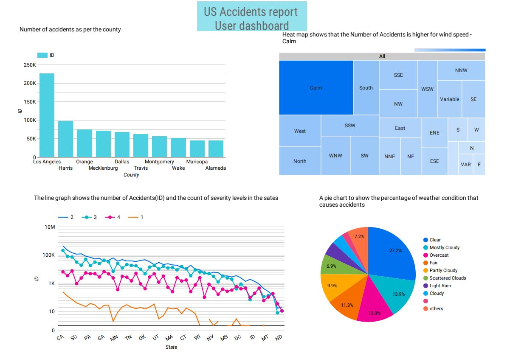

# Route Recommendation and Severity Prediction to reduce Accidents using Predictive Analysis

## Team Members:
- Aditya Kamble (akamble@uncc.edu)
- Sidharth Panda (spanda3@uncc.edu)

### Research Questions
  - What is the number of accidents of a state as compared to its adjacent states?
  - Why and how wind speed and wind direction contribute to accidents?
  - How does Weather condition and time affect visibility which results in the number of accidents?
  - Do accidents happen due to stop signs w.r.t time of the day?
  - Is the accident rates in different states higher due to different Weather Condition?

### Audience 
  - Regular vehicle users
  - Autonomous Vehicle manufactures like Tesla, Hyundai etc.  

### Domain and Data: Identify domain and source(s) of data
#### Dataset - US Accidents (3 Million Records)

**A Countrywide Traffic Accident Dataset (2016 - 2019)**

This is a countrywide traffic accident dataset, which covers 49 states of the United States. The data is collected from February 2016 to December 2019, using several data providers, including two APIs which provide streaming traffic event data. These APIs broadcast traffic events captured by a variety of entities, such as the US and state departments of transportation, law enforcement agencies, traffic cameras, and traffic sensors within the road-networks. Currently, there are about 3.0 million accident records in this dataset.

Since the dataset contains 3.0 million records, It’s difficult for a user to bring out the useful insights.
Specific questions like the Total number of accidents per city or state can be calculated using statistics, but more details related to the individual factors affecting the result can be sought by visualization.  Having a multiple columns helps in finding the relation between several factors responsible for the accidents can be explored and explained through visualization.

### User Dashboard - Easy to understand visualization

**Kaggle Dataset Link:** https://www.kaggle.com/sobhanmoosavi/us-accidents

- Preprocessing:
  - Check for Missing values and replace them using Mean or Median of data
  - Work on feature selection among given features and generate new features using grouping and aggregation techniques
  - Prepare dataset features to be compatible with different types of visualization

#### [Evaluating Machine Learning Projects Forty Three Rules of Machine Learning](https://github.com/kbs-group-9/kbs-group-9.github.io/blob/master/Evaluating%20Machine%20Learning%20Projects_%20Forty%20Three%20Rules%20of%20Machine%20Learning.pdf)

#### [Link to the notebook](https://github.com/kbs-group-9/kbs-group-9.github.io/blob/master/notebooks/US%20Accidents%20-%20EDA.ipynb)

- Size of Dataset - 3 Million records with 49 feature columns
  
### Detailed plan for data ingest, ML, Evaluation of Results and Presentation of Results, Production Model
(note:  analysis must use Hadoop, Big Query, PySpark, as many tools as possible from class)

  - Data Ingesion completed - Used SQL instance to extract data to Data Studio for creation of dashboard
  - Using BigQuery to fetch data into AI Notebook for EDA
  - We will be building ML Models to predict Accident Severity based on weather, wind, time, etc
  - ML models to classify the accidents based on certain parameters using PySpark and ML-Lib

### Research citations:
  - https://crashstats.nhtsa.dot.gov/Api/Public/ViewPublication/811059
